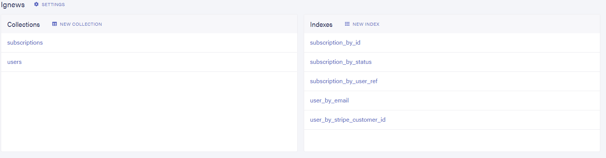
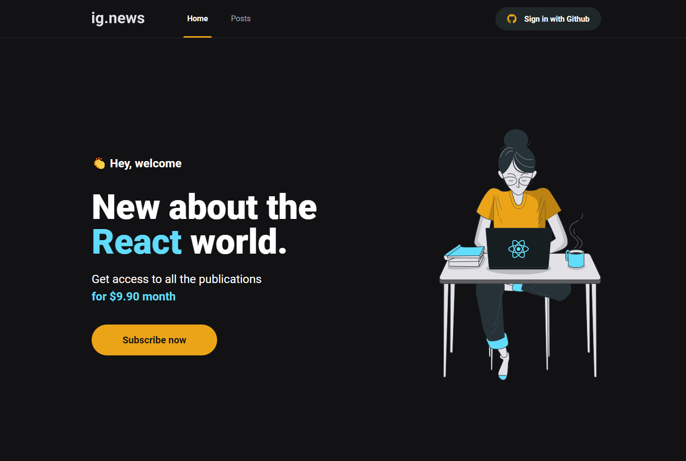
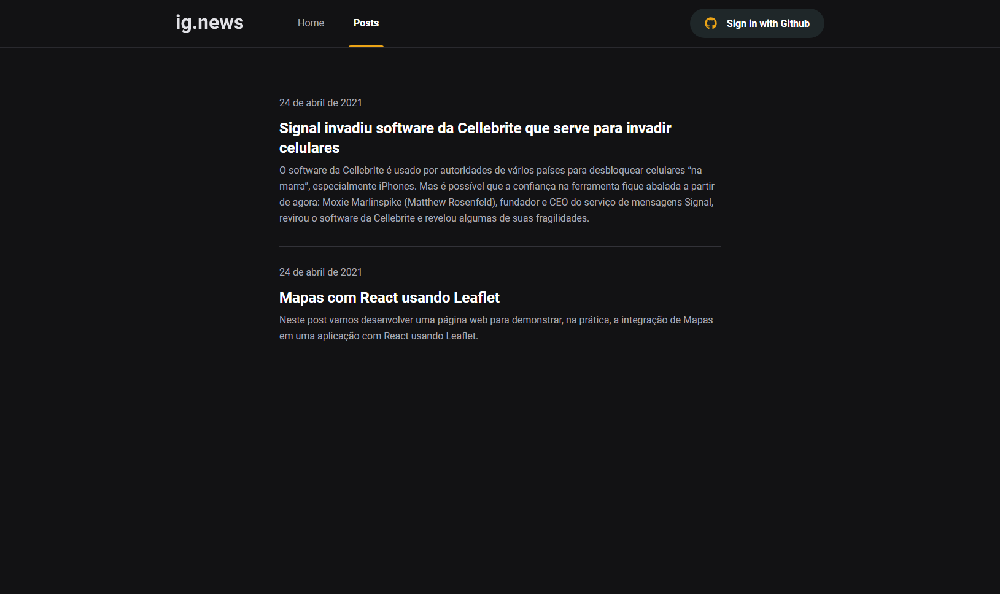
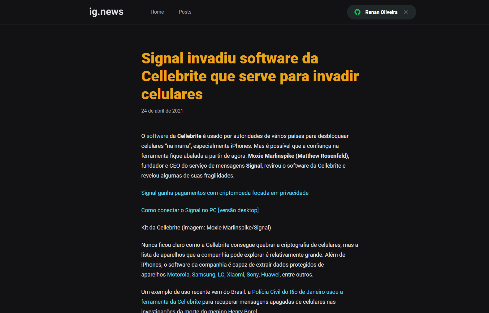

[](https://choosealicense.com/licenses/mit)
[](https://nextjs.org/)
[](https://github.com/renanlido/ignews/commits)

<!--LOGO-->
<br/>
<div align="center">
    <a href="">
        
    </a>
    <h3 color="#ffff" >The blog!</h3>
    </br>
</div>

<!-- ABOUT THE PROJECT -->
# <strong>Sobre o Projeto</strong>
Este projeto visa a criação de um blog desenvolvido em aula no curso [Ignite da Rocketseat](https://rocketseat.com.br)

</br>

# <strong>Tecnologias Utilizadas</strong>
### Neste projeto utilizamos: 
<strong>[Next.js](https://nextjs.org/)</strong> : Next.js oferece a melhor experiência de desenvolvedor com todos os recursos de que você precisa para produção: renderização híbrida estática e de servidor, suporte a TypeScript, agrupamento inteligente, pré-busca de rota e muito mais.

<strong>[ReactJs](https://pt-br.reactjs.org/)</strong> : Uma biblioteca JavaScript para criar interfaces de usuário. A tecnologia NextJs roda com ReactJs por baixo dos panos o que nos permite ter flexibilidade de criar e reutilizar componentes além de utilizar a metologia SPA (Single Page Aplication) em algumas páginas do projeto.

<strong>[Stripe](https://stripe.com/br)</strong> : Um pacote de produtos de pagamento totalmente integrados. Foi escolhido por se tratar de uma plataforma mais voltada para sites e aplicativos.

<strong>[SASS](https://sass-lang.com/)</strong> : Sass é a linguagem de extensão CSS de nível profissional mais madura, estável e poderosa do mundo. A utilizamos em opção ao Styled Components.

<strong>[Prismic](https://prismic.io)</strong> : Prismic é o CMS headless ideal para React, Vue e Jamstack.

<strong>[Fauna](https://fauna.com)</strong> : Fauna é um banco de dados transacional flexível e amigável ao desenvolvedor, disponível como uma API segura na nuvem com GraphQL nativo.

</br>

<!--INSTALATION-->

# Instalação

1. Para instalar e utilizar este projeto o processo é bem simples, após clonar o projeto utilize o comando:
    ```sh
    yarn
    ```
Caso não tenha o yarn instalado, utilize o gerenciador de pacotes da sua preferência.        

2. Para utilizar todos os recursos será necessário criar uma conta no **Stripe**, **Prismic** e **Fauna** para gerar as respectivas access token e end point. Será também necessário criar uma Oauth App no guithub neste endereço (https://github.com/settings/developers).

3. Criar um arquivo **.env.local** na raiz do projeto com a seguinte configuração.
    ```sh
    #STRIPE
    STRIPE_API_KEY=
    NEXT_PUBLIC_STRIPE_API_PUBLIC_KEY=
    STRIPE_SUCCESS_URL="http://localhost:3000/posts"
    STRIPE_CANCEL_URL="http://localhost:3000"
    STRIPE_WEBHOOK_SECRET=
    
    #GITHUB
    GITHUB_ID=
    GITHUB_SECRET=
    
    #FAUNADB
    FAUNADB_KEY=
    
    #URL
    BASE_URL:"http://localhost:3000"
    
    #PRISMIC CMS
    PRISMIC_ACCESS_TOKEN=
    PRISMIC_END_POINT=
    ```

4. Será necessário também configurar uma **DATABASE** no **Fauna** com nome **Ignews** e respecitvas **Collections** e **Index**.


5. Após isto, utilize o comando abaixo para rodar o aplicativo.
```ssh 
yarn dev 
```
</br>

<!--THE RESULT-->

# <strong>O resultado!</strong>


<div>
    </br>
</div>



<div>
    </br>
</div>


<div>
    </br>
</div>




<div>
    </br>
</div>

<!-- LICENSE -->

# **Licença**

Distribuído sob a licença MIT. Veja `LICENSE` para mais informações.

<!-- CONTACT -->
</br>

# **Contato**

### Renan Oliveira - **renanlido@yahoo.com.br**

[Github](https://github.com/renanlido) - **https://github.com/renanlido** </br>
[Linkedin](https://www.linkedin.com/in/renanlido/) - **https://www.linkedin.com/in/renanlido/**

</br></br>
Obrigado por ter vindo 😊🤗
